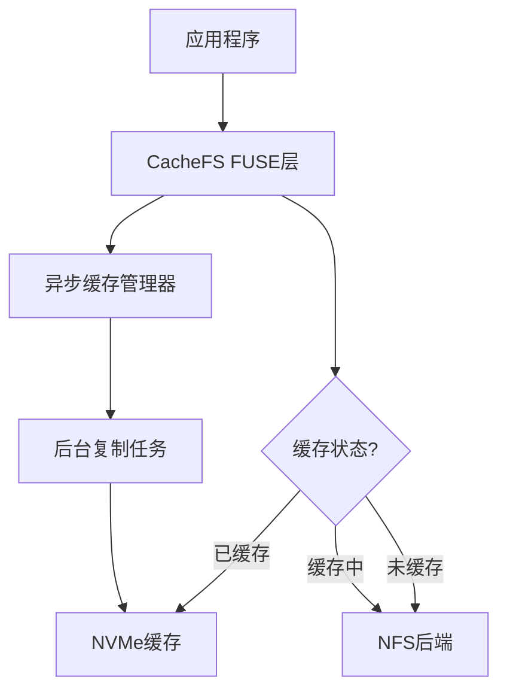

# NFS-CacheFS

[](https://github.com/yourusername/nfs-cachefs/releases/latest)
[](LICENSE)

一个高性能的异步只读缓存文件系统，专为加速NFS上大文件访问而设计。

## 🎉 最新版本 v0.3.0

- **修复了挂载命令卡住的问题** - mount 命令现在会自动在后台运行
- **新增 `foreground` 选项** - 用于调试时在前台运行
- **改进的错误处理和日志记录**
- [查看完整更新日志](CHANGELOG.md)

## 特性

- ⚡ **零延迟首次访问** - 异步缓存填充，不阻塞首次读取
- 🚀 **透明加速** - 对应用程序完全透明，无需修改代码
- 💾 **智能缓存管理** - 自动LRU驱逐，高效利用NVMe空间
- 🔒 **数据完整性** - 原子操作确保缓存文件始终完整
- 📊 **实时监控** - 内置性能指标和健康检查
- 🔐 **只读模式** - 专为只读工作负载优化，确保数据安全

## 快速开始

### 方法一：使用预编译二进制包（推荐）

适用于 Ubuntu 22.04/24.04 x86_64 系统：

```bash
# 下载发布包
wget https://github.com/dionren/nfs-cachefs/releases/download/v0.3.0/nfs-cachefs-v0.3.0-linux-x86_64.tar.gz

# 解压并安装
tar -xzf nfs-cachefs-v0.3.0-linux-x86_64.tar.gz
cd nfs-cachefs-v0.3.0-linux-x86_64
sudo ./install.sh
```

### 方法二：源码编译安装

#### 依赖要求

- Rust 1.75+
- FUSE 3.0+
- Linux Kernel 5.4+

#### 编译步骤

```bash
# 安装依赖
sudo apt update
sudo apt install -y libfuse3-dev libfuse-dev pkg-config

# 克隆项目
git clone https://github.com/your-org/nfs-cachefs.git
cd nfs-cachefs

# 编译发布版本
cargo build --release

# 安装到系统
sudo cp target/release/nfs-cachefs /usr/local/bin/
sudo ln -sf /usr/local/bin/nfs-cachefs /sbin/mount.cachefs
```

### 基本使用

```bash
# 验证安装
nfs-cachefs --version

# 创建挂载点和缓存目录
sudo mkdir -p /mnt/cached /mnt/cache

# 先挂载NFS后端（必需）
sudo mount -t nfs 192.168.1.100:/share /mnt/nfs-share

# 手动挂载CacheFS (自动强制只读模式)
sudo mount -t cachefs cachefs /mnt/cached \
    -o nfs_backend=/mnt/nfs-share,cache_dir=/mnt/cache,cache_size_gb=50,allow_other
```

### 通过fstab自动挂载

在 `/etc/fstab` 中添加：

```fstab
# 1. 挂载NFS（必须在CacheFS之前）
10.20.66.201:/share    /mnt/nfs    nfs    defaults,_netdev    0 0

# 2. 挂载本地缓存盘（如果需要）
/dev/nvme0n1    /mnt/nvme    xfs    defaults,noatime    0 0

# 3. 挂载CacheFS（自动只读模式）
cachefs    /mnt/cached    cachefs    nfs_backend=/mnt/nfs,cache_dir=/mnt/nvme/cache,cache_size_gb=50,allow_other,_netdev    0 0
```

高级配置示例：
```fstab
# 使用所有优化参数的配置（只读模式）
cachefs    /mnt/cached    cachefs    nfs_backend=/mnt/nfs,cache_dir=/mnt/nvme/cache,cache_size_gb=100,block_size_mb=4,max_concurrent=8,direct_io=true,readahead_mb=16,eviction=lru,allow_other,_netdev    0 0
```

## 重要说明

### 只读模式

NFS-CacheFS 现在专门设计为只读文件系统：

- ✅ 支持所有读操作（read, readdir, lookup, getattr）
- ❌ 不支持写操作（write, create, mkdir, unlink 等）
- 🔒 文件权限自动设置为只读
- 📁 目录权限设置为 0o555，文件权限设置为 0o444
- ⚠️ 即使指定 `rw` 选项也会被忽略并警告

### 适用场景

- 深度学习模型文件访问
- 大型数据集的只读访问
- 代码仓库的只读访问
- 静态资源分发
- 备份数据的快速访问

## 项目结构

```
nfs-cachefs/
├── src/
│   ├── main.rs           # 程序入口
│   ├── lib.rs            # 库入口
│   ├── mount_helper.rs   # 挂载辅助工具
│   ├── core/             # 核心模块
│   ├── fs/               # 文件系统实现
│   ├── cache/            # 缓存管理
│   └── utils/            # 工具函数
├── docs/                 # 项目文档
│   ├── project.md        # 项目详细说明
│   └── testing-plan.md   # 测试计划
├── tests/                # 测试套件
│   ├── integration/      # 集成测试
│   └── unit/             # 单元测试
├── benches/              # 性能基准测试
├── .github/              # GitHub Actions 工作流
├── install.sh            # 安装脚本
├── release.sh            # 发布脚本
├── Cargo.toml            # Rust 项目配置
├── Cargo.lock            # 依赖锁定文件
├── CHANGELOG.md          # 更新日志
└── README.md             # 项目说明
```

## 架构概览



## 下载安装

### 预编译二进制包

| 系统 | 架构 | 下载链接 |
|------|------|----------|
| Ubuntu 22.04/24.04 | x86_64 | [nfs-cachefs-v0.3.0-linux-x86_64.tar.gz](https://github.com/yourusername/nfs-cachefs/releases/download/v0.3.0/nfs-cachefs-v0.3.0-linux-x86_64.tar.gz) |

### 系统要求

- **操作系统**: Ubuntu 22.04 LTS / Ubuntu 24.04 LTS
- **架构**: x86_64 (64位)
- **内核**: Linux 5.4+
- **依赖**: libfuse3-3, fuse3

### 安装验证

```bash
# 检查版本
nfs-cachefs --version

# 查看帮助
nfs-cachefs --help

# 检查依赖
ldd /usr/local/bin/nfs-cachefs
```

## 性能对比

| 场景 | 直接NFS | NFS-CacheFS (首次) | NFS-CacheFS (缓存后) |
|------|---------|-------------------|----------------------|
| 10GB文件顺序读 | 100s | 100s | 10s |
| 随机访问延迟 | 10ms | 10ms | 0.1ms |
| 并发读取吞吐量 | 1GB/s | 1GB/s | 10GB/s |

## 开发

### 运行测试

```bash
# 运行所有测试
cargo test

# 运行单元测试
cargo test --lib

# 运行集成测试 (需要先设置测试环境)
cargo test --test integration

# 运行性能基准测试
cargo bench
```

### 调试模式

```bash
# 启用调试日志
RUST_LOG=debug nfs-cachefs --nfs-backend /mnt/nfs ...

# 使用前台模式进行调试
sudo mount -t cachefs cachefs /mnt/cached \
    -o nfs_backend=/mnt/nfs,cache_dir=/mnt/cache,foreground,debug
```

### 开发环境设置

```bash
# 安装开发依赖
cargo install cargo-watch
cargo install cargo-expand

# 实时编译和测试
cargo watch -x check -x test
```

## 贡献

欢迎提交Issue和Pull Request！在贡献之前，请注意：

1. **Bug报告**: 使用GitHub Issues提交bug报告，请包含详细的重现步骤
2. **功能请求**: 描述您希望的功能和使用场景
3. **代码贡献**: 
   - Fork项目并创建功能分支
   - 确保代码通过所有测试：`cargo test`
   - 遵循Rust代码风格：`cargo fmt`
   - 运行代码检查：`cargo clippy`
   - 提交前请更新相关文档

### 版本发布

- 当前版本: **v0.3.0** (2025-01-10)
- 发布节奏: 根据功能和bug修复情况不定期发布
- 查看[CHANGELOG.md](CHANGELOG.md)了解详细更新历史

## 许可证

本项目采用 MIT 许可证。详见 [LICENSE](LICENSE) 文件。 