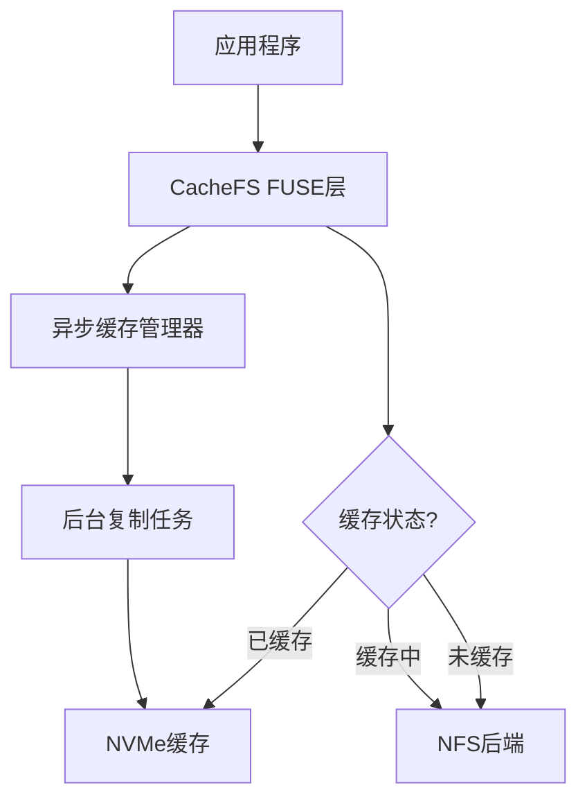

# NFS-CacheFS

[](https://github.com/yourusername/nfs-cachefs/releases/latest)
[](LICENSE)

一个高性能的异步只读缓存文件系统，专为加速NFS上大文件访问而设计。

## 🎉 最新版本 v0.5.1

- **🚀 重大性能修复** - 解决缓存未命中时NFS读取极慢的问题
- **⚡ 优化读取逻辑** - 缓存命中走异步，缓存未命中走同步
- **🔧 架构改进** - 移除异步队列瓶颈，保持NFS客户端优化
- [查看完整更新日志](CHANGELOG.md)

## 特性

- ⚡ **零延迟首次访问** - 异步缓存填充，不阻塞首次读取
- 🚀 **透明加速** - 对应用程序完全透明，无需修改代码
- 💾 **智能缓存管理** - 自动LRU驱逐，高效利用NVMe空间
- 🔒 **数据完整性** - 原子操作确保缓存文件始终完整
- 📊 **实时监控** - 内置性能指标和健康检查
- 🔐 **只读模式** - 专为只读工作负载优化，确保数据安全
- 🚢 **静态编译** - 无依赖部署，兼容所有Linux发行版

## 快速开始

### 方法一：使用预编译二进制包（推荐）

```bash
# 下载发布包
wget https://github.com/dionren/nfs-cachefs/releases/download/v0.5.1/nfs-cachefs-v0.5.1-linux-x86_64.tar.gz

# 解压并安装
tar -xzf nfs-cachefs-v0.5.1-linux-x86_64.tar.gz
cd nfs-cachefs-v0.5.1-linux-x86_64
sudo ./install.sh
```

### 方法二：源码编译安装

#### 依赖要求

- Rust 1.75+
- musl工具链（用于静态编译）

#### 编译步骤

```bash
# 克隆项目
git clone https://github.com/your-org/nfs-cachefs.git
cd nfs-cachefs

# 使用Makefile构建
make build

# 或直接运行构建脚本
./build/build-release.sh

# 安装到系统
sudo cp target/x86_64-unknown-linux-musl/release/nfs-cachefs /usr/local/bin/
sudo ln -sf /usr/local/bin/nfs-cachefs /sbin/mount.cachefs
```

### 基本使用

```bash
# 验证安装
nfs-cachefs --version

# 创建挂载点和缓存目录
sudo mkdir -p /mnt/cached /mnt/cache

# 先挂载NFS后端（必需）
sudo mount -t nfs 192.168.1.100:/share /mnt/nfs-share

# 手动挂载CacheFS (自动强制只读模式)
sudo mount -t cachefs cachefs /mnt/cached \
    -o nfs_backend=/mnt/nfs-share,cache_dir=/mnt/cache,cache_size_gb=50,allow_other
```

### 通过fstab自动挂载

在 `/etc/fstab` 中添加：

```fstab
# 1. 挂载NFS（必须在CacheFS之前）
10.20.66.201:/share    /mnt/nfs    nfs    defaults,_netdev    0 0

# 2. 挂载本地缓存盘（如果需要）
/dev/nvme0n1    /mnt/nvme    xfs    defaults,noatime    0 0

# 3. 挂载CacheFS（自动只读模式）
cachefs    /mnt/cached    cachefs    nfs_backend=/mnt/nfs,cache_dir=/mnt/nvme/cache,cache_size_gb=50,allow_other,_netdev    0 0
```

高级配置示例：
```fstab
# 使用所有优化参数的配置（只读模式）
cachefs    /mnt/cached    cachefs    nfs_backend=/mnt/nfs,cache_dir=/mnt/nvme/cache,cache_size_gb=100,block_size_mb=4,max_concurrent=8,direct_io=true,readahead_mb=16,eviction=lru,allow_other,_netdev    0 0
```

## 项目结构

```
nfs-cachefs/
├── src/                  # 源代码
│   ├── main.rs           # 程序入口
│   ├── lib.rs            # 库入口
│   ├── mount_helper.rs   # 挂载辅助工具
│   ├── core/             # 核心模块
│   ├── fs/               # 文件系统实现
│   ├── cache/            # 缓存管理
│   └── utils/            # 工具函数
├── build/                # 构建系统
│   ├── build-release.sh  # 主构建脚本
│   ├── install.sh        # 安装脚本
│   └── BUILD_GLIBC_COMPATIBILITY.md  # 构建文档
├── tests/                # 测试套件
├── .github/              # GitHub Actions 工作流
├── Makefile              # 构建快捷方式
├── Cargo.toml            # Rust 项目配置
├── Cargo.lock            # 依赖锁定文件
├── CHANGELOG.md          # 更新日志
└── README.md             # 项目说明
```

## 构建系统

### 使用Makefile（推荐）

```bash
# 静态编译构建（生产环境）
make build

# 本地开发构建
make local-build

# 清理构建产物
make clean

# 查看帮助
make help
```

### 直接使用构建脚本

```bash
# 静态编译（推荐）
./build/build-release.sh

# 查看构建文档
cat ./build/BUILD_GLIBC_COMPATIBILITY.md
```

## 开发

### 运行测试

```bash
# 运行所有测试
cargo test

# 运行集成测试 (需要先设置测试环境)
cargo test --test integration
```

### 调试模式

```bash
# 启用调试日志
RUST_LOG=debug nfs-cachefs --nfs-backend /mnt/nfs ...

# 使用前台模式进行调试
sudo mount -t cachefs cachefs /mnt/cached \
    -o nfs_backend=/mnt/nfs,cache_dir=/mnt/cache,foreground,debug
```

### 开发环境设置

```bash
# 安装开发依赖
cargo install cargo-watch
cargo install cargo-expand

# 实时编译和测试
cargo watch -x check -x test
```

## 性能对比

| 场景 | 直接NFS | NFS-CacheFS (首次) | NFS-CacheFS (缓存后) |
|------|---------|-------------------|----------------------|
| 10GB文件顺序读 | 100s | 100s | 10s |
| 随机访问延迟 | 10ms | 10ms | 0.1ms |
| 并发读取吞吐量 | 1GB/s | 1GB/s | 10GB/s |

## 技术特性

### 静态编译优势

- ✅ **无依赖部署**：单一二进制文件，无需安装额外库
- ✅ **广泛兼容性**：支持任何Linux发行版，无论glibc版本
- ✅ **容器友好**：适合Docker和Kubernetes部署
- ✅ **简化运维**：减少部署复杂性和依赖管理

### 架构概览



## 贡献

欢迎提交Issue和Pull Request！在贡献之前，请注意：

1. **Bug报告**: 使用GitHub Issues提交bug报告，请包含详细的重现步骤
2. **功能请求**: 描述您希望的功能和使用场景
3. **代码贡献**: 
   - Fork项目并创建功能分支
   - 确保代码通过所有测试：`cargo test`
   - 遵循Rust代码风格：`cargo fmt`
   - 运行代码检查：`cargo clippy`
   - 提交前请更新相关文档

### 版本发布

- 当前版本: **v0.5.1** (2025-01-10)
- 发布节奏: 根据功能和bug修复情况不定期发布
- 查看[CHANGELOG.md](CHANGELOG.md)了解详细更新历史

## 许可证

本项目采用 MIT 许可证。详见 [LICENSE](LICENSE) 文件。 