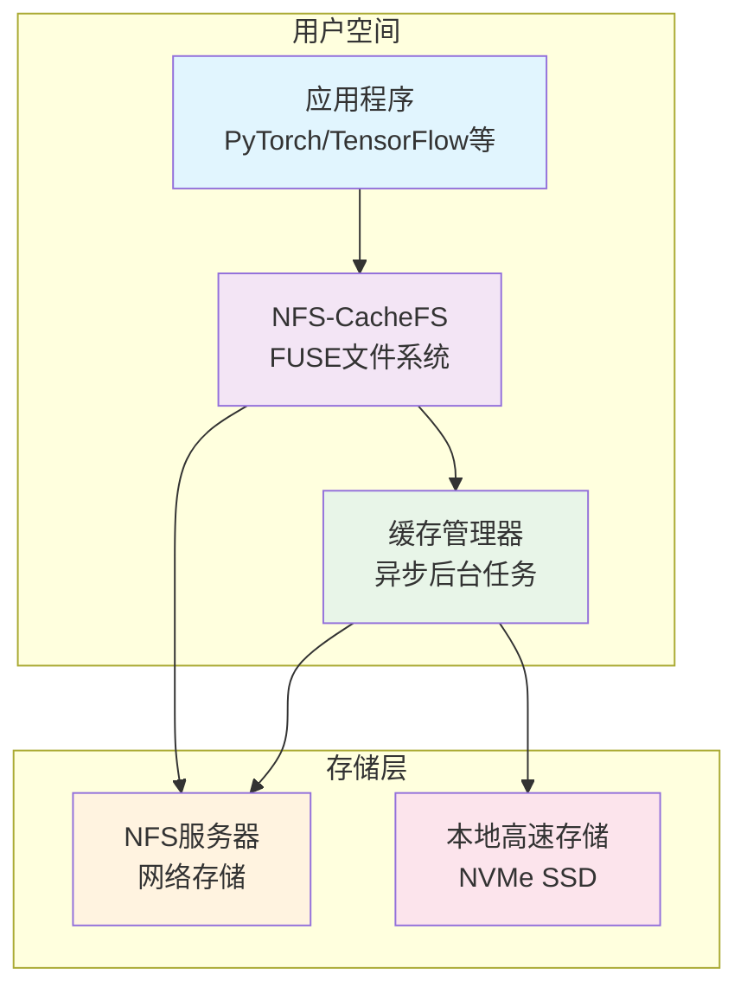
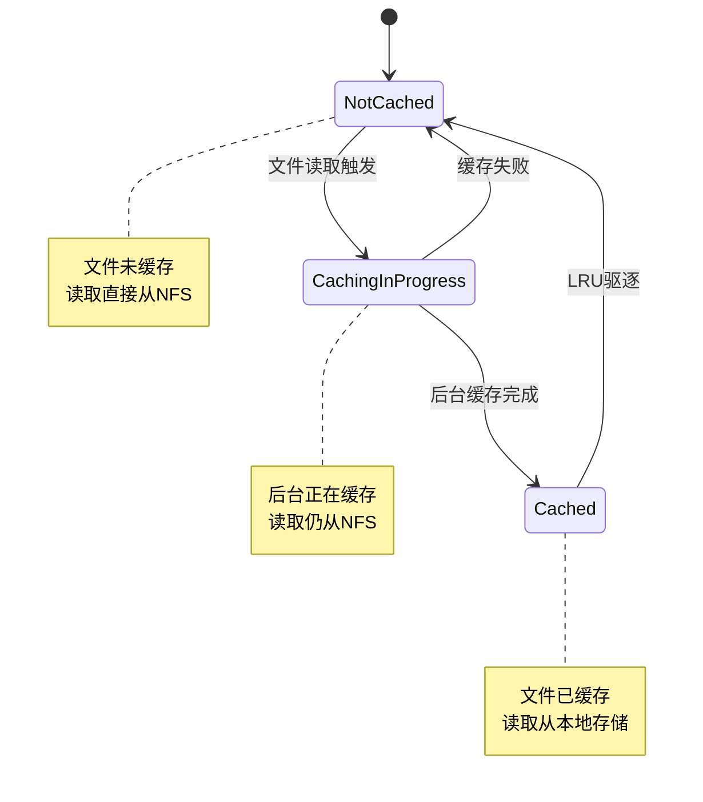

# NFS-CacheFS: 高性能只读缓存文件系统

## 项目概述

NFS-CacheFS 是一个基于 FUSE 的**高性能只读**异步缓存文件系统，专门设计用于加速 NFS 上大型文件（如深度学习模型、数据集）的读取访问。通过将文件异步缓存到本地高速存储设备，实现对应用程序完全透明的性能提升。

### 核心特性

- **只读设计**：专门针对大文件读取场景优化，不支持写入操作
- **零延迟首次访问**：首次读取直接穿透到 NFS，避免缓存等待
- **异步后台缓存**：在后台独立完成文件复制，不影响前台操作
- **智能缓存管理**：基于 LRU 的自动驱逐策略，高效利用存储空间
- **透明部署**：通过 fstab 配置即可使用，无需修改应用程序

### 目标场景

- **深度学习训练**：加速大型模型文件（10-100GB）的读取
- **数据分析**：提升大型数据集的访问性能
- **批处理任务**：优化需要频繁读取大文件的批处理作业
- **高并发读取**：支持多个进程同时读取同一文件

## 系统架构

### 整体架构



### 文件缓存状态机



### 技术栈

- **编程语言**：Rust（高性能和内存安全）
- **文件系统框架**：FUSE（用户态文件系统）
- **异步运行时**：Tokio（高并发异步处理）
- **核心组件**：
  - `fuser`：Rust FUSE 绑定
  - `lru`：LRU 缓存实现
  - `dashmap`：并发安全的哈希表
  - `tracing`：结构化日志
  - `parking_lot`：高性能同步原语

## 核心设计原则

### 1. 只读优先

- **设计理念**：专门为大文件读取场景优化，不处理写入操作
- **安全保障**：强制只读模式，防止意外修改原始数据
- **性能优化**：简化文件系统逻辑，专注于读取性能

### 2. 异步缓存策略

- **首次访问**：直接从 NFS 读取，不等待缓存完成
- **后台缓存**：独立线程异步复制文件到本地存储
- **原子操作**：使用临时文件+重命名确保缓存文件完整性
- **并发控制**：限制同时进行的缓存任务数量

### 3. 智能缓存管理

- **LRU 驱逐**：基于最近最少使用算法自动清理缓存
- **空间监控**：实时监控缓存空间使用情况
- **完整性校验**：可选的文件校验和验证机制
- **性能指标**：详细的缓存命中率和性能统计

### 4. 透明部署

- **标准挂载**：通过 `/etc/fstab` 配置，无需额外配置文件
- **应用无感知**：对应用程序完全透明，无需修改代码
- **灵活配置**：支持多种配置参数优化性能

## 核心模块

### 文件系统层
- **功能**：实现 FUSE 接口，处理文件系统操作
- **特性**：支持 lookup、getattr、open、read、readdir 等操作
- **限制**：不支持写入操作（write、create、mkdir 等）

### 缓存管理器
- **功能**：管理后台缓存任务和缓存状态
- **特性**：异步任务调度、并发控制、错误处理
- **策略**：LRU 驱逐、空间管理、完整性校验

### 异步执行器
- **功能**：处理异步文件系统操作
- **特性**：高并发处理、任务队列、资源管理
- **优化**：减少系统调用、批量处理

### 监控系统
- **功能**：收集和报告性能指标
- **指标**：缓存命中率、读取延迟、存储使用率
- **输出**：结构化日志、Prometheus 指标

## 性能优化

### 1. 零拷贝技术
- 使用 Linux 特定系统调用减少数据复制
- 内存映射优化大文件访问
- 直接 I/O 绕过系统缓存

### 2. 预读取策略
- 智能预取提高顺序访问性能
- 基于访问模式的预测算法
- 可配置的预读取大小

### 3. 并发优化
- 高效的并发数据结构
- 无锁算法减少竞争
- 任务队列优化

## 配置参数

### 必需参数
- `nfs_backend`：NFS 后端目录路径
- `cache_dir`：本地缓存目录路径
- `cache_size_gb`：最大缓存大小（GB）

### 可选参数
- `block_size_mb`：缓存块大小（MB，默认 1）
- `max_concurrent`：最大并发缓存任务数（默认 4）
- `eviction`：缓存驱逐策略（lru/lfu/arc，默认 lru）
- `checksum`：是否启用校验和（true/false，默认 false）
- `ttl_hours`：缓存过期时间（小时，默认无限制）
- `direct_io`：是否使用直接 I/O（true/false，默认 true）
- `readahead_mb`：预读取大小（MB，默认 4）

## 部署配置

### 安装步骤

1. **编译程序**
   ```bash
   cargo build --release
   ```

2. **安装二进制文件**
   ```bash
   sudo cp target/release/nfs-cachefs /usr/local/bin/
   ```

3. **创建 mount helper 链接**
   ```bash
   sudo ln -s /usr/local/bin/nfs-cachefs /sbin/mount.cachefs
   ```

### fstab 配置

#### 基本配置格式

```fstab
cachefs /挂载点 cachefs 选项列表 0 0
```

#### 最小配置示例

```fstab
# 1. 挂载 NFS（必须在 CacheFS 之前）
10.20.66.201:/share  /mnt/nfs  nfs  defaults,_netdev  0 0

# 2. 挂载本地缓存磁盘
/dev/nvme0n1  /mnt/nvme  xfs  defaults,noatime  0 0

# 3. 挂载 CacheFS（只读模式）
cachefs  /mnt/cached  cachefs  nfs_backend=/mnt/nfs,cache_dir=/mnt/nvme/cache,cache_size_gb=50,ro,allow_other,_netdev  0 0
```

#### 完整配置示例

```fstab
# 带有所有高级选项的配置
cachefs  /mnt/cached  cachefs  nfs_backend=/mnt/nfs,cache_dir=/mnt/nvme/cache,cache_size_gb=100,block_size_mb=4,max_concurrent=8,eviction=lru,checksum=true,ttl_hours=24,direct_io=true,readahead_mb=8,ro,allow_other,_netdev  0 0
```

#### 配置参数详解

**必需参数**：
- `nfs_backend=/mnt/nfs` - NFS 后端挂载路径
- `cache_dir=/mnt/nvme/cache` - 本地缓存目录路径
- `cache_size_gb=50` - 最大缓存大小（GB）

**可选参数**：
- `block_size_mb=4` - 缓存块大小（MB，默认 1）
- `max_concurrent=8` - 最大并发缓存任务数（默认 4）
- `eviction=lru` - 缓存驱逐策略（lru/lfu/arc，默认 lru）
- `checksum=true` - 启用文件校验和（默认 false）
- `ttl_hours=24` - 缓存过期时间（小时，默认无限制）
- `direct_io=true` - 使用直接I/O（默认 true）
- `readahead_mb=8` - 预读取大小（MB，默认 4）

**FUSE 标准参数**：
- `ro` - 只读模式（强制）
- `allow_other` - 允许其他用户访问挂载点
- `_netdev` - 标记为网络文件系统，确保网络就绪后才挂载

### 性能调优配置

#### 大文件场景（深度学习模型）

```fstab
cachefs /mnt/cached cachefs nfs_backend=/mnt/nfs,cache_dir=/mnt/nvme/cache,cache_size_gb=200,block_size_mb=4,max_concurrent=4,direct_io=true,readahead_mb=16,ro,allow_other,_netdev 0 0
```

关键参数：
- `block_size_mb=4` - 较大的块大小提高大文件传输效率
- `readahead_mb=16` - 增大预读取以提高顺序读性能

#### 小文件场景（代码仓库）

```fstab
cachefs /mnt/cached cachefs nfs_backend=/mnt/nfs,cache_dir=/mnt/nvme/cache,cache_size_gb=50,block_size_mb=1,max_concurrent=16,eviction=lfu,ro,allow_other,_netdev 0 0
```

关键参数：
- `block_size_mb=1` - 较小的块大小减少浪费
- `max_concurrent=16` - 增加并发数处理大量小文件
- `eviction=lfu` - 使用 LFU 策略更适合小文件访问模式

#### 混合负载场景

```fstab
cachefs /mnt/cached cachefs nfs_backend=/mnt/nfs,cache_dir=/mnt/nvme/cache,cache_size_gb=100,block_size_mb=2,max_concurrent=8,eviction=arc,checksum=true,ttl_hours=72,ro,allow_other,_netdev 0 0
```

关键参数：
- `eviction=arc` - 自适应替换缓存，平衡 LRU 和 LFU
- `checksum=true` - 确保数据完整性
- `ttl_hours=72` - 3天后自动清理过期缓存

### 命令行使用

```bash
# 基本挂载
nfs-cachefs /mnt/nfs /mnt/cached -o cache_dir=/mnt/nvme/cache,cache_size_gb=50

# 带高级选项
nfs-cachefs /mnt/nfs /mnt/cached -o cache_dir=/mnt/nvme/cache,cache_size_gb=100,max_concurrent=8,block_size_mb=64

# 前台运行（调试用）
nfs-cachefs /mnt/nfs /mnt/cached -o cache_dir=/mnt/nvme/cache,cache_size_gb=50 -f -d
```

### 故障排查

#### 查看挂载状态

```bash
# 检查挂载点
mount | grep cachefs

# 查看详细挂载选项
findmnt /mnt/cached -o OPTIONS
```

#### 手动挂载测试

```bash
# 使用 mount 命令手动测试配置
sudo mount -t cachefs cachefs /mnt/cached -o nfs_backend=/mnt/nfs,cache_dir=/mnt/nvme/cache,cache_size_gb=50
```

#### 查看系统日志

```bash
# 查看挂载相关日志
journalctl -u mnt-cached.mount

# 查看 CacheFS 运行日志
journalctl -t cachefs
```

### 卸载

```bash
# 正常卸载
sudo umount /mnt/cached

# 强制卸载（如果有进程占用）
sudo umount -l /mnt/cached
```

### 重要注意事项

1. **挂载顺序**：确保 NFS 和缓存目录在 CacheFS 之前挂载
2. **只读模式**：必须使用 `ro` 参数，不支持写入操作
3. **权限设置**：缓存目录需要适当的读写权限
4. **空间预留**：缓存目录所在分区应预留一定空间避免写满
5. **网络依赖**：使用 `_netdev` 标记确保网络就绪后才挂载
6. **依赖管理**：可使用 `x-systemd.requires-mounts-for` 确保依赖挂载点就绪

## 性能预期

基于类似系统的实测数据和理论分析：

| 指标 | 提升幅度 | 说明 |
|------|----------|------|
| 大文件顺序读取 | 10-20x | 取决于网络速度和存储性能 |
| 随机访问 | 50-100x | 本地存储延迟远低于网络 |
| 缓存命中后延迟 | 100-1000x | 微秒级 vs 毫秒级 |
| 多进程并发读取 | 5-10x | 减少网络争用 |
| 缓存命中率 | >90% | 稳定工作负载下 |

## 运维管理

### 监控指标
- 缓存命中率和miss率
- 读取延迟分布
- 存储使用率
- 并发任务数
- 错误率统计

### 日志管理
- 结构化日志输出
- 可配置的日志级别
- 关键事件记录
- 性能指标日志

### 故障处理
- 自动降级到直接 NFS 访问
- 损坏文件自动清理
- 缓存空间不足处理
- 网络异常恢复

## 限制与约束

### 功能限制
- **只读文件系统**：不支持任何写入操作
- **不支持元数据修改**：chmod、chown、setxattr 等
- **不支持符号链接创建**：只能读取现有符号链接
- **不支持文件锁**：不处理文件锁定请求

### 性能约束
- **初始延迟**：首次访问文件时延迟与直接 NFS 访问相同
- **存储依赖**：缓存性能受限于本地存储速度
- **内存使用**：元数据缓存会占用一定内存
- **并发限制**：受配置的最大并发任务数限制

### 部署约束
- **需要FUSE支持**：内核必须支持 FUSE
- **权限要求**：需要挂载权限或 root 权限
- **存储空间**：需要足够的本地存储空间用于缓存
- **网络依赖**：NFS 网络连接必须稳定

## 项目价值

1. **显著性能提升**：大文件读取性能提升 10-100 倍
2. **完全透明**：无需修改应用程序，即插即用
3. **简化部署**：通过 fstab 配置即可使用
4. **高可靠性**：只读设计避免数据损坏风险
5. **资源高效**：智能缓存管理最大化存储利用率
6. **成本有效**：利用现有硬件提升性能，无需额外投资

## 适用场景

### 理想场景
- 频繁读取大文件（GB级别）
- 读取多于写入的工作负载
- 网络带宽成为瓶颈
- 具有局部性的访问模式

### 不适用场景
- 需要写入操作的应用
- 文件很小（KB级别）
- 完全随机的访问模式
- 实时性要求极高的应用

---

**注意**：NFS-CacheFS 是专门为读取优化的只读文件系统，不支持任何写入操作。如需写入，请直接操作原始 NFS 挂载点。 